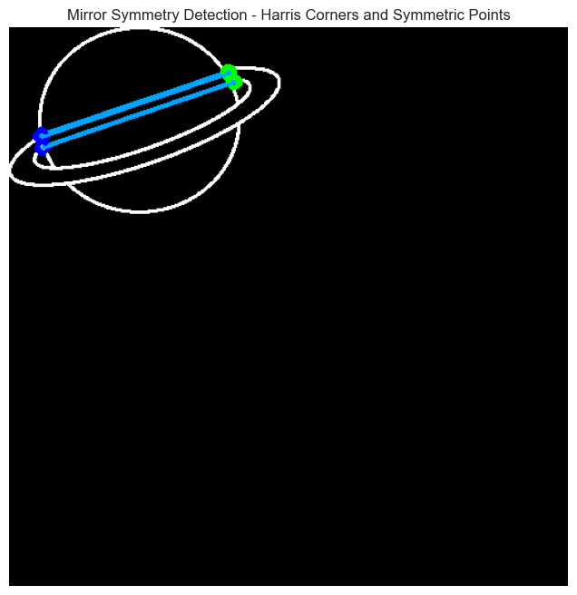
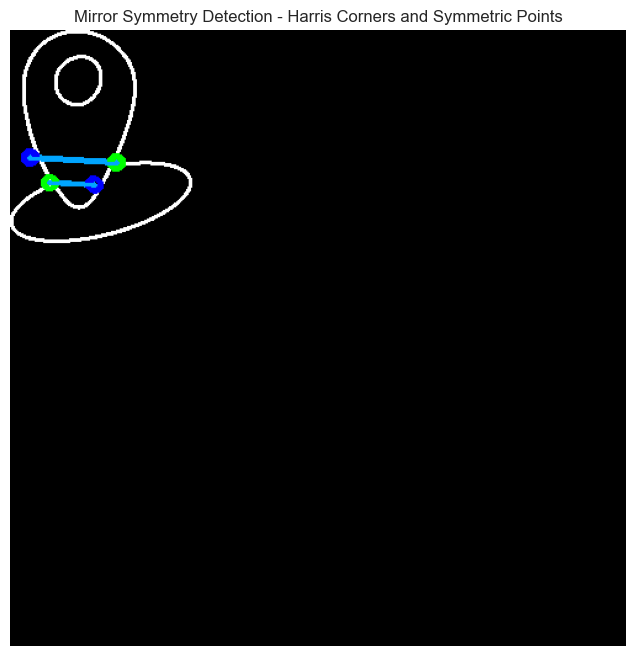
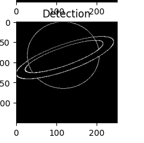
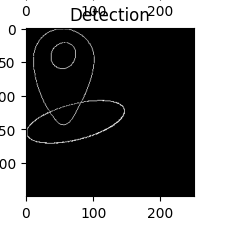

# Symmetry Detection and Analysis Algorithm (Algorithm 1)

--Output Using Algorithm 1
This algorithm efficiently identifies and analyzes symmetry in images through a series of methodical steps:

## 1. **Finding the Line of Symmetry**
   - **SIFT Feature Matching:**
     - Utilizes SIFT (Scale-Invariant Feature Transform) to extract keypoints and descriptors from both the original image and its horizontally flipped version.
     - Matches these features using a brute-force matcher (`BFMatcher`), selecting the most accurate matches.
   - **Hexbin Analysis:**
     - Analyzes matched points by calculating the angle and distance (`r`, `theta`) relative to the X-axis.
     - Generates a hexbin plot to visualize the distribution of these `(r, θ)` pairs.
   - **Vote Sorting:**
     - Examines the hexbin plot to identify the most prominent bin, indicating the most likely line of symmetry.

## 2. **Finding and Selecting Harris Corners**
   - **Corner Detection:**
     - Applies Harris corner detection to identify points with significant intensity changes, often corresponding to corners.
   - **Thresholding and Sorting:**
     - Filters detected corners using a threshold and selects the top 15 based on their corner response values (corner strength).
   - **Code Implementation:**
     - The `detect_harris_corners` function processes the image, converting it to grayscale, applying the Harris corner detector, and selecting the top 15 corners.

## 3. **Finding Corresponding Points on the Opposite Side**
   - **Symmetry Line Equation:**
     - Determines the line of symmetry (given by `r` and `theta`), and calculates each detected corner's symmetric counterpart using geometric properties of the line.
   - **Opposite Point Calculation:**
     - Computes the corresponding point for each corner on the opposite side of the symmetry line by reflecting the point across the line.

## 4. **Connecting Points Using B-Spline**
   - **Spline Drawing:**
     - Draws a B-spline curve connecting each original corner and its symmetric counterpart.
     - The `draw_b_spline_curve` function interpolates between these points to create smooth connecting curves.

## Final Display
   - The final image displays the original Harris corners, their symmetric counterparts, the symmetry line, and the B-spline curves connecting each pair of points.

---

This approach combines feature matching, symmetry detection, corner detection, and curve interpolation to analyze and visualize symmetry in images.

---

# Generalized Hough Transform Algorithm for Shape Detection (Algorithm 2)

--Output Using Algorithm 2
This algorithm detects shapes in images using the Generalized Hough Transform. It involves several steps including edge detection, gradient orientation computation, and gradient accumulation.

## Key Components and Steps

### 1. **Edge Detection and Gradient Orientation**
   - **Canny Edge Detection:**
     - Uses the `canny` function to detect edges in the image, effective for identifying boundaries.
   - **Gradient Orientation Calculation:**
     - Computes gradient orientation using the Sobel filter, with gradients calculated in both x and y directions (`dx` and `dy`).

### 2. **R-Table Construction**
   - **Building the R-Table:**
     - Constructs an R-Table based on detected edges and their gradient orientations. It stores relative positions (vectors) of edge points with respect to a reference point.

### 3. **Accumulation of Gradients**
   - **Accumulate Gradients Using R-Table:**
     - Uses the R-Table to accumulate votes in an accumulator array. For each edge point, the function looks up corresponding vectors and increments the accumulator.

### 4. **Overlay and Visualization**
   - **Overlay the Reference Image:**
     - The `overlay_reference_image` function overlays the reference image on the query image at the detected position.
   - **Visualization:**
     - The `test_general_hough` function visualizes the results including the reference image, query image with detected points, the accumulator, and the final overlay.

### 5. **Testing and Usage**
   - **Shape-to-Image Conversion:**
     - Converts a set of shapes into binary images using the `shapes_to_image` function.
   - **Testing:**
     - The `test` function reads shape data from CSV files, converts them to images, and applies the Generalized Hough Transform.

## Example Workflow

1. **Read and Convert Shape Data:**
   - Read shape data from CSV files and convert them to binary images.

2. **Apply Generalized Hough Transform:**
   - Apply the Generalized Hough Transform to the query image using the reference images.

3. **Visualize Results:**
   - Visualize the results including the best match and the overlayed reference image.

## Code Summary

- **Edge Detection:** Uses Canny edge detection and Sobel filter.
- **R-Table Construction:** Creates a lookup table for edge points.
- **Gradient Accumulation:** Accumulates votes in an accumulator array.
- **Overlay and Visualization:** Displays detected shapes and overlays the reference image..

---

# Generalized Hough Transform Algorithm for Shape Detection With Multi-Scale and Multi-Shift Detection (Algorithm 3)

--Output Using Algorithm 3

This advanced algorithm detects shapes using the Generalized Hough Transform with added multi-scale and multi-shift detection capabilities.

## Key Components and Steps

### 1. **Edge Detection and Gradient Orientation**
   - **Canny Edge Detection:**
     - Uses the `canny` function to detect edges effectively.
   - **Gradient Orientation Calculation:**
     - Computes gradient orientation using the Sobel filter.

### 2. **R-Table Construction**
   - **Building the R-Table:**
     - Constructs an R-Table based on detected edges and orientations.

### 3. **Accumulation of Gradients**
   - **Accumulate Gradients Using R-Table:**
     - Accumulates votes in an accumulator array.

### 4. **Multi-Scale and Multi-Shift Detection**
   - **Generate Shifts:**
     - Creates a list of possible shifts for the reference image.
   - **Multi-Scale Detection:**
     - Tests different scales of the reference image to detect size variations.
   - **Multi-Shift Detection:**
     - Tests various shifts to find the best alignment.

### 5. **Overlay and Visualization**
   - **Overlay the Reference Image:**
     - Overlays the reference image on the query image at the detected position.
   - **Visualization:**
     - Visualizes the results including the reference image, query image with detected points, and the final overlay.

### 6. **Testing and Usage**
   - **Shape-to-Image Conversion:**
     - Converts shapes to binary images.
   - **Testing:**
     - Reads shape data from CSV files, converts them to images, and applies the Generalized Hough Transform.

## Example Workflow

1. **Read and Convert Shape Data:**
   - Read and convert shape data from CSV files to binary images.

2. **Apply Generalized Hough Transform:**
   - Apply the Generalized Hough Transform with multi-scale and multi-shift detection.

3. **Visualize Results:**
   - Visualize the best match and overlayed reference image.

## Code Summary

- **Edge Detection:** Uses Canny edge detection and Sobel filter.
- **R-Table Construction:** Creates a lookup table for edge points.
- **Gradient Accumulation:** Accumulates votes in an accumulator array.
- **Multi-Scale and Multi-Shift Detection:** Tests different scales and shifts.
- **Overlay and Visualization:** Displays the detected shapes and overlays the reference image.
.

---
