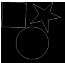
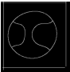
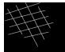
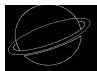

# Curvetopia Project README

Find deployed link here: [Deployed website](https://adobe-gensolve.streamlit.app/)

[YouTube](https://www.youtube.com/watch?v=0-AD3taWdGs)

## Tour to our repository
* We have developed once agorithm for [Regularization Task](/Regularization/) and four different algorithm for shape completion ([Shape detection and Completion](/Algorithm%204%20(Shape%20Detection%20and%20Completion)/).[Generalized Hough Transform with Multi-Scaling and Multi-Shifting](/Algorithm%203%20(Generalised%20Hough%20Transfrom%20with%20SIFT)/).[Generalized Hough Transform with Template Shapes README](/Algorithm%202%20(Generalised%20Hough%20Transform)/).[Symmetry-Based B-Spline Algorithm README](/Algorithm%201%20(Using%20Line%20of%20Symmetry)/))

* Motivation behind developing four different algos for curve completion was during our research we found that there is no proper algo to complete this task and each task has its own pros and cons.

* You can find *.ipynb files*, *testcases* and *generated images and csv* for each algorith in [master_folder](/master_folder/).

* To see eda of input csv you can see [eda.ipynb](/master_folder/eda.ipynb/)

* To see deploment code of our website go to [deployment](/deployment/)

## Overview

Curvetopia is a project focused on identifying, regularizing, and beautifying various types of curves in 2D Euclidean space. The project involves converting line art from a PNG image into a set of connected cubic Bezier curves.

## Regularization Task

We have completed the regularization of curves. For detailed information on this process, please refer to the [Regularization Task README](/Regularization/README.md/).

- **Output**:  

## Occlusion Handling

For the occlusion handling task, we have proposed and implemented the following algorithms:

### 1. Symmetry-Based B-Spline Algorithm

- **Process:**
  1. Find the line of symmetry in the image.
  2. Detect corners using Harris corner detection.
  3. Filter the top 15 corners.
  4. Find the corresponding opposite points on the other side of the line of symmetry.
  5. Connect these points using B-Spline curves.

- **Details:** For a detailed explanation and implementation of this algorithm, please refer to the [Symmetry-Based B-Spline Algorithm README](/Algorithm%201%20(Using%20Line%20of%20Symmetry)/README.md/).

### 2. Generalized Hough Transform

- **Process:**
  - Apply the Generalized Hough Transform using predefined template shapes to detect and complete occluded curves.

- **Details:** For a detailed explanation and implementation of this algorithm, please refer to the [Generalized Hough Transform with Template Shapes README](/Algorithm%202%20(Generalised%20Hough%20Transform)/README.md).

### 3. Generalized Hough Transform with Multi-Scaling and Multi-Shifting

- **Process:**
  - Use the Generalized Hough Transform with predefined template shapes, incorporating multi-scaling and multi-shifting techniques to handle various scales and positions of occluded curves.

- **Details:** For a detailed explanation and implementation of this algorithm, please refer to the [Generalized Hough Transform with Multi-Scaling and Multi-Shifting README](/Algorithm%203%20(Generalised%20Hough%20Transfrom%20with%20SIFT)/README.md).

### 4. Shape detection and Completion
- **Process:**
  - In this algorith we are iterating over each polyline and if incomplete shape is detected in particular polyline our algo sucessfully completes it.
- **Details:** For a detailed explanation and implementation of this algorithm, please refer to the [Shape detection and Completion](/Algorithm%204%20(Shape%20Detection%20and%20Completion)/README.md).

## Output Using The Above Mentioned Algorithms

- **Output Using Algorithm 1**: 

- **Output Using Algorithm 2**: 

- **Output Using Algorithm 3**:  

- **Output Using Algorithm 4**:  

## Contributing

If you would like to contribute to the Curvetopia project, please refer to the [Contributing Guidelines](link-to-contributing-guidelines).

## License

This project is licensed under the MIT License. See the [LICENSE](link-to-license) file for more details.

