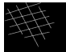

## Sample Output

## Overview

- This script processes 2D curves from a CSV file to detect and regularize geometric shapes.
- Detected shapes are replaced with their regularized versions using OpenCV.
- Outputs a combined image visualizing the regularized shapes.

## Key Functions

- **smooth_points**: Smooths the curve points using spline interpolation.
- **interpolate_points**: Interpolates points to create a denser set of coordinates.
- **points_to_image**: Converts a set of points into a binary image.
- **detect_shapes**: Detects shapes (circles, triangles, rectangles, etc.) within the curve.
- **draw_shapes**: Draws detected shapes or curves on a blank image.
- **combine_images**: Combines multiple images into a single large image.

## Working

1. Load curve data from a CSV file.
2. Smooth and interpolate the points for each curve.
3. Convert points to an image and detect any geometric shapes.
4. Replace detected shapes with regularized shapes and store results.
5. Generate a combined image of all processed shapes.

## Output

- **Image**: Combined image of detected and regularized shapes.
- **CSV**: Updated coordinates of regularized shapes.
